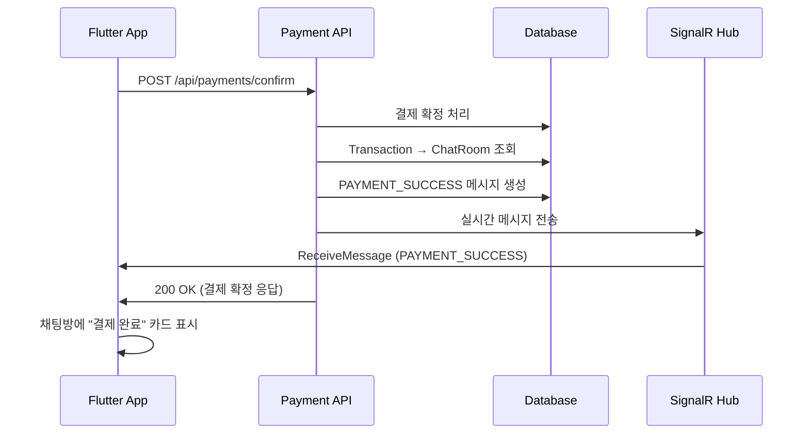

# 백엔드 API 보완 요청: 결제 완료 시 채팅 메시지 자동 생성

## 📋 요청 개요

**목적**: 결제 확정 성공 시, 해당 채팅방에 `PAYMENT_SUCCESS` 타입의 메시지를 자동으로 생성하여 프론트엔드에서 "결제 완료 카드"를 렌더링할 수 있도록 합니다.

**현재 문제점**:
- 결제 요청 시: `PAYMENT_REQUEST` 타입 메시지가 자동 생성되어 카드 형태로 표시됨 ✅
- 결제 완료 시: 메시지가 자동 생성되지 않아 프론트엔드에서 텍스트 메시지만 전송 중 ❌

---

## 🔧 수정 요청 사항

### 1. MessageType Enum 확장

**파일**: `MessageType` enum (또는 해당 모델)

```csharp
public enum MessageType
{
    TEXT,
    IMAGE,
    PAYMENT_REQUEST,
    PAYMENT_SUCCESS  // 추가
}
```

---

### 2. 결제 확정 API 수정

#### 기존 API
```
POST /api/payments/confirm
```

**Request Body**:
```json
{
  "paymentKey": "string",
  "orderId": "string",
  "amount": 180000
}
```

**기존 Response**:
```json
{
  "success": true,
  "data": {
    "paymentKey": "tgen_...",
    "orderId": "ORDER_20240130_001",
    "orderName": "IU Concert Ticket",
    "status": "DONE",
    "requestedAt": "2024-01-30T15:30:00Z",
    "approvedAt": "2024-01-30T15:31:00Z",
    "method": "카드",
    "totalAmount": 180000,
    "balanceAmount": 180000
  }
}
```

---

#### 수정 요청: 결제 성공 시 채팅 메시지 자동 생성

**추가 동작**:
1. 결제 확정 성공 후
2. 해당 `orderId`에 연결된 `transactionId` 조회
3. `transactionId`로 `roomId` (채팅방 ID) 조회
4. **채팅 메시지 자동 생성**:
   - `type`: `PAYMENT_SUCCESS`
   - `roomId`: 조회된 채팅방 ID
   - `senderId`: 시스템 계정 (또는 구매자 ID)
   - `message`: `null` (카드 형태이므로 텍스트 불필요)

**예시 SQL/로직**:
```csharp
// 1. Transaction 조회
var transaction = await _context.Transactions
    .FirstOrDefaultAsync(t => t.OrderId == orderId);

if (transaction == null) return;

// 2. ChatRoom 조회
var chatRoom = await _context.ChatRooms
    .FirstOrDefaultAsync(c => c.TicketId == transaction.TicketId);

if (chatRoom == null) return;

// 3. 메시지 생성
var message = new Message
{
    RoomId = chatRoom.RoomId,
    SenderId = transaction.BuyerId,  // 또는 시스템 계정
    Type = MessageType.PAYMENT_SUCCESS,
    Message = null,
    CreatedAt = DateTime.UtcNow
};

await _context.Messages.AddAsync(message);
await _context.SaveChangesAsync();

// 4. SignalR로 실시간 전송
await _hubContext.Clients.Group($"room_{chatRoom.RoomId}")
    .SendAsync("ReceiveMessage", new NewMessageSignalDto
    {
        MessageId = message.MessageId,
        RoomId = message.RoomId,
        SenderId = message.SenderId,
        SenderNickname = "시스템",
        Type = "PAYMENT_SUCCESS",
        Message = null,
        CreatedAt = message.CreatedAt
    });
```

---

### 3. 응답 구조 (변경 없음)

기존 응답 구조 유지. 메시지 생성은 **내부 로직**으로만 처리하며, API 응답에는 포함하지 않습니다.

---

## 📊 데이터 흐름



---

## 🧪 테스트 시나리오

### 1. 정상 케이스
1. 결제 요청 → `PAYMENT_REQUEST` 메시지 생성 확인
2. 결제 완료 → `PAYMENT_SUCCESS` 메시지 자동 생성 확인
3. 채팅방에서 두 메시지 모두 카드 형태로 표시 확인

### 2. 예외 케이스
- `orderId`에 해당하는 Transaction이 없는 경우 → 메시지 생성 스킵 (로그만 남김)
- ChatRoom이 없는 경우 → 메시지 생성 스킵
- SignalR 전송 실패 → 메시지는 DB에 저장, 다음 폴링 시 조회 가능

---

## 📝 프론트엔드 대응 사항

### 이미 구현 완료
- `MessageType.paymentSuccess` enum 추가 ✅
- `PaymentSuccessCard` 위젯 생성 ✅
- `ChatBubble`에서 `paymentSuccess` 타입 렌더링 로직 추가 ✅

### 백엔드 수정 후 제거할 코드
```dart
// payment_viewmodel.dart (제거 예정)
if (state.roomId != null) {
  await ref.read(sendMessageUsecaseProvider).call(
    SendMessageParams(
      roomId: state.roomId!,
      message: '결제가 완료되었습니다. 상품을 전송해주세요.',
    ),
  );
}
```

---

## ⏰ 우선순위

**High**: 사용자 경험에 직접적인 영향을 미치는 핵심 기능입니다.

---

## 📞 문의사항

구현 중 질문이나 추가 정보가 필요하시면 언제든지 연락 주세요.

**담당자**: [프론트엔드 개발자 이름]  
**작성일**: 2026-01-30

빌게이츠가 노래방에 가면?
싱어게인